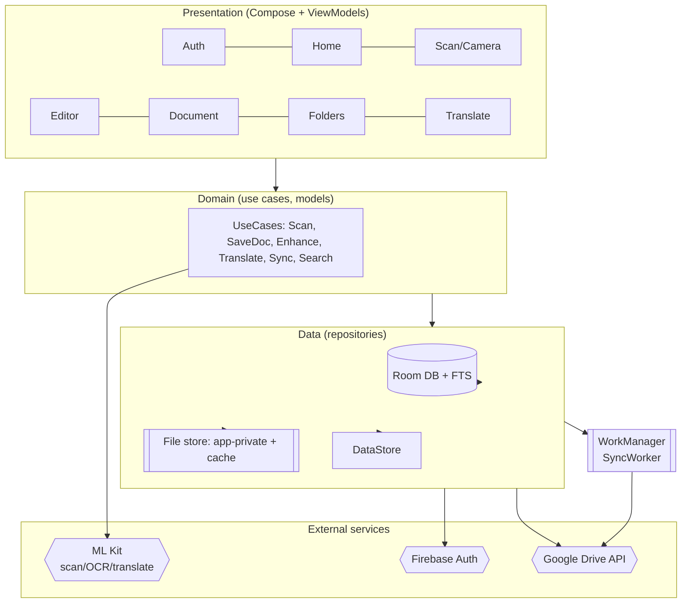
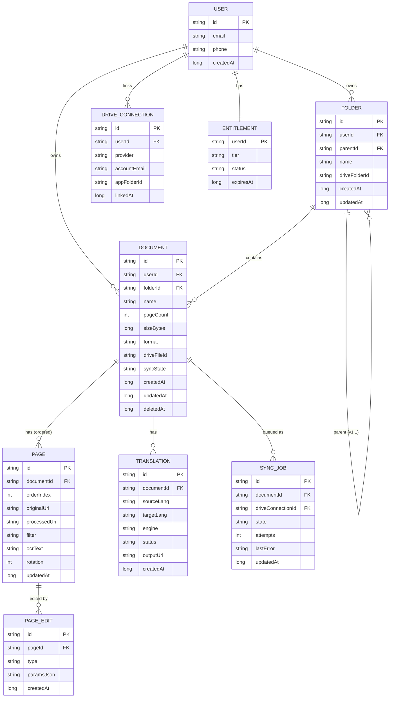

# ScanPro — Build Specification (Engineering)

**Platform:** Android (v1) · **Target release:** Play Store
**Companion docs:** [PRD.md](PRD.md) · [figma-design.html](figma-design.html) · [scan-pro-figma-wireframes.html](scan-pro-figma-wireframes.html)
**Status:** Draft v1.0 · **Date:** 2026-07-17

> This document is the technical build spec. It translates the PRD requirements (FR-*/NFR-*) and the UI designs into an implementable architecture, data model, module plan, and delivery pipeline. Requirement IDs in brackets trace back to [PRD.md](PRD.md).

---

## 1. Scope & principles

**In scope (v1):** phone/email auth, unlimited multi-page scanning, on-device OCR, page editing (reorder/add/remove/crop/rotate/erase/resize/insert-image), create-PDF-from-device-photos, compression/optimization, folders, Google Drive auto-sync, on-device translation, PDF/image export, full-text search.

**Deferred:** iOS, desktop/web, Dropbox/OneDrive, nested folders (TBD), cloud translation (paid tier, v1.1).

**Engineering principles**
1. **On-device first.** Scanning, OCR, and free-tier translation run on-device (ML Kit) — zero marginal cost, offline-capable, privacy-preserving. [PRD §11.1]
2. **User-owned storage.** Documents live in the user's own Drive; our backend holds only lightweight metadata. No document blobs on our servers. [PRD §11.1, §11.3]
3. **Offline-capable, sync-eventual.** Every action works offline; sync is a background, retryable process. [NFR-6]
4. **Free core, entitlement-gated extras.** One app, Play Billing gates paid power features (cloud translation in v1.1). No separate build flavor.

---

## 2. Tech stack

| Concern | Choice | Rationale |
|---|---|---|
| Language | **Kotlin 2.x** | Android-native, first-class ML Kit / Jetpack support |
| UI | **Jetpack Compose** (Material 3) | Matches Compose-friendly designs; less boilerplate |
| Architecture | **MVVM + UDF** (unidirectional data flow) | Testable, Compose-idiomatic |
| DI | **Hilt** | Standard Android DI |
| Async | **Coroutines + Flow** | Structured concurrency, reactive streams |
| Camera | **CameraX** | Lifecycle-aware capture, broad device support |
| Doc detection | **ML Kit Document Scanner** | On-device edge detect + perspective + filters [FR-3.2/3.3] |
| OCR | **ML Kit Text Recognition v2** | On-device, free [FR-3.8] |
| Translation (free) | **ML Kit Translation** | On-device, offline models [FR-6.*] |
| Translation (paid, v1.1) | Cloud Translation / DeepL API | Higher accuracy, entitlement-gated [PRD §11.1] |
| Local DB | **Room** (SQLite) + FTS4/5 | Metadata + full-text search [FR-4.6] |
| Key-value | **DataStore (Proto)** | Settings/preferences |
| Background work | **WorkManager** | Reliable, constraint-aware sync/upload [FR-7.*] |
| Auth | **Firebase Auth** (Phone OTP + Email) | Managed OTP/email, recovery [FR-1.*] |
| Cloud drive | **Google Drive REST API v3** + Google Sign-In | User-owned storage [FR-7.*] |
| PDF | **android.graphics.pdf.PdfDocument** | Native multi-page PDF [FR-3.7] |
| Images | **Coil** | Compose image loading |
| Billing (v1.1) | **Play Billing Library** | Paid power features |
| Crash/analytics | **Firebase Crashlytics + Analytics** | Stability + funnel metrics [PRD §9] |
| Build | **Gradle (Kotlin DSL) + AGP 8.x** | Standard |

> **Decision to confirm:** native **Kotlin + Compose** is recommended over Flutter for v1 because scanning/OCR/translation lean heavily on Android ML Kit and CameraX (native, no plugin-bridge friction), and v1 is Android-only. If a cheaper future iOS port outweighs that, revisit Flutter before code starts — it changes this entire spec.

**SDK targets:** `minSdk 26` (Android 8.0 — covers ML Kit + ~95% devices), `targetSdk 35`, `compileSdk 35`.

---

## 3. Architecture



**Layering**
- **Presentation:** Compose screens + `ViewModel`s exposing immutable `UiState` via `StateFlow`; events flow down, intents flow up.
- **Domain:** Pure Kotlin use cases and models; no Android deps (unit-testable).
- **Data:** Repositories are the single source of truth. Room is authoritative for metadata; file store holds page images/PDFs; Drive is the backup/sync target.

**Module structure (Gradle modules)**
```
:app                      # entry, DI graph, navigation host
:core:ui                  # design system (tokens from figma-design.html), components
:core:common              # utils, Result types, dispatchers
:core:data                # Room, DataStore, repositories, sync
:core:domain              # use cases, domain models
:feature:auth
:feature:scan             # camera + capture + enhance
:feature:editor           # page ops: reorder/add/remove/crop/rotate/erase/resize/insert-image, compression
:feature:documents        # list, detail, export, search
:feature:folders
:feature:translate
:feature:sync             # Drive integration + WorkManager workers
:feature:settings
```

---

## 4. Data model (Room / local schema)

This doubles as the **ERD**. Room is local source of truth; `remoteId`/`driveFileId` link to the user's Drive.



**Notes**
- **Soft delete:** `DOCUMENT.deletedAt` supports trash/restore [PRD §11.6]; hard purge is a background job.
- **`syncState`** enum: `LOCAL_ONLY | PENDING | UPLOADING | SYNCED | FAILED` → drives the per-item badge on Home/Detail [FR-2.4/7.4].
- **Full-text search:** an FTS table mirrors `PAGE.ocrText` (+ `DOCUMENT.name`) for `FR-4.6`.
- **PAGE stores both `originalUri` and `processedUri`** → non-destructive editing [FR-E.8]; `PAGE_EDIT` records ops (crop/rotate/erase params) for undo/redo history [FR-E.7].
- **Files** are **not** in the DB. Page images and generated PDFs live in app-private storage (`filesDir/documents/{documentId}/…`), referenced by URI. Cache dir holds transient capture frames.

---

## 5. Key flows (build-level)

### 5.1 Scan → save → sync [FR-3.*, FR-7.*]
1. `ScanViewModel` drives CameraX + ML Kit Document Scanner; each capture yields a `Page` (original + auto-enhanced `processedUri`). No page cap (list-backed). [FR-3.1/3.4]
2. Kick off **OCR** per page on a background dispatcher; write `ocrText` → FTS. [FR-3.8]
3. Editor operates on the in-memory ordered page list; reorder/add/remove/crop/rotate/erase mutate the list and append `PAGE_EDIT` records. [FR-E.*]
4. Save: render pages → `PdfDocument` (or image bundle), persist `DOCUMENT`+`PAGE` rows, set `syncState=PENDING`, enqueue `SyncJob`. [FR-3.7]
5. `SyncWorker` (WorkManager, network+optional Wi‑Fi-only constraint) uploads to Drive app folder → sets `driveFileId`, `syncState=SYNCED`; retries with backoff on failure. [FR-7.2/7.3/7.4]

### 5.2 Erase / clean-up [FR-E.5]
- v1: **mask + fill** — user selects region (brush/box); fill sampled from local background (median/blur of surrounding pixels). "Auto" runs the ML Kit scanner's shadow/edge cleanup. [FR-E.6]
- Content-aware inpainting (higher quality) is a **v1.1+** enhancement — do not block v1 on it. [PRD §11.8]
- All erases are non-destructive (operate on a copy; `originalUri` retained).

### 5.3 Translate [FR-6.*]
- OCR text → ML Kit Translation. Auto-detect source (`LanguageIdentification`), download target model on demand, translate, cache result as `TRANSLATION`.
- Free tier = on-device. v1.1 adds cloud engine behind an `Entitlement` check.

### 5.4 Auth [FR-1.*]
- Firebase Auth: phone (OTP) and email (link/password). Token/session in `EncryptedSharedPreferences`. Recovery via Firebase flows.
- Drive linked separately via Google Sign-In (incremental auth) — scope `drive.file` (app-created files only; least privilege). [FR-1.5/7.1]

---

## 6. External integrations & contracts

| Integration | Auth | Key scopes/params | Cost note |
|---|---|---|---|
| Firebase Auth | API key + app config | Phone OTP (SMS), Email | **SMS billed per message** — prefer email; monitor. [PRD §11.1] |
| Google Drive v3 | OAuth (Google Sign-In) | `https://www.googleapis.com/auth/drive.file` | Free; uses user's own quota. Handle quota-full + 403 rate limits. [PRD §11.4] |
| ML Kit | bundled/on-device | scanner, text-recognition, translate, language-id | Free, offline. Translation models downloaded per-language. |
| Play Billing (v1.1) | Play account | subscription/one-time for cloud translation | Revenue for paid tier. |

**Least-privilege:** use `drive.file` (not full `drive`) so the app only sees files it creates — smaller consent surface and reduced privacy risk. [PRD §11.3]

---

## 7. Permissions

| Permission | Why | Notes |
|---|---|---|
| `CAMERA` | Scanning [FR-3.1] | Requested on first Scan tap (not onboarding) |
| `POST_NOTIFICATIONS` (33+) | Sync status | Runtime prompt |
| `INTERNET`, `ACCESS_NETWORK_STATE` | Auth, sync, translate models | Normal |
| Scoped storage / SAF | Import + export | No broad `READ/WRITE_EXTERNAL_STORAGE`; use `ACTION_OPEN_DOCUMENT` / MediaStore [FR-3.6/4.5] |

---

## 8. Security & privacy [NFR-3, PRD §11.3]

- **At rest:** page images/PDFs in **app-private** storage; sensitive files via `EncryptedFile` (Jetpack Security). Optional app-lock (BiometricPrompt).
- **DB:** consider **SQLCipher** for Room if storing OCR text of sensitive docs (evaluate perf).
- **Secrets/tokens:** `EncryptedSharedPreferences`. No secrets in source; inject via Gradle/`local.properties` + CI secrets.
- **In transit:** TLS only; certificate transparency by default.
- **Data leaving device:** only Drive uploads (user's own account) and, in v1.1, cloud-translation text (disclose in privacy policy; confirm provider retention). Free tier keeps OCR/translation on-device.
- **Compliance:** privacy policy + data-safety form for Play; GDPR/regional review before EU launch.

---

## 9. Non-functional targets [NFR-*]

- Capture preview latency < 300 ms; 20-page PDF generation < 5 s on mid-range device.
- No data loss on process death (persist capture session incrementally).
- Accessibility: TalkBack labels, dynamic type, ≥ 4.5:1 contrast (design tokens already meet this).
- Localization: UI strings externalized; RTL support.
- Crash-free sessions > 99.5%.

---

## 10. Build, config & tooling

- **Gradle Kotlin DSL**, version catalog (`libs.versions.toml`) for dependency pinning.
- **Build types:** `debug`, `release` (R8/ProGuard minify + resource shrink on release).
- **Signing:** upload key in CI secret; Play App Signing enabled.
- **Config/secrets:** `local.properties` (dev) + CI env for Firebase config, Google OAuth client, (v1.1) Billing/translation keys. Never committed.
- **Static analysis:** ktlint + detekt + Android Lint in CI (fail on error).
- **Feature gating:** remote config (Firebase) for kill-switches and staged rollout of paid features.

---

## 11. CI/CD

**GitHub Actions (or equivalent)**
1. **PR check:** ktlint/detekt/lint → unit tests → assemble debug.
2. **Merge to main:** instrumented tests (emulator matrix) → build release AAB → upload to **Play Internal testing** + **Firebase App Distribution** for QA.
3. **Release:** promote internal → closed → production track; Crashlytics gating.

Artifacts: AAB, mapping.txt (upload to Crashlytics for deobfuscation).

---

## 12. Testing strategy

| Layer | Tooling | Focus |
|---|---|---|
| Unit | JUnit5, MockK, Turbine | use cases, repositories, sync state machine, PDF assembly |
| DB | Room in-memory | migrations, FTS queries |
| UI | Compose UI Test | screen states, editor gestures, error/empty states |
| Integration | Hilt test + fakes | Drive repo (fake API), WorkManager test harness |
| Manual/device | test matrix | camera on varied devices, OCR/translation accuracy on sample docs [PRD §11.2] |

**Special:** OCR/translation quality benchmarks on a fixed sample-document set (accuracy is the free-tier risk — measure before shipping). [PRD §11.7]

---

## 13. Repo layout

```
scan-pro/
├─ app/
├─ core/{ui,common,data,domain}/
├─ feature/{auth,scan,editor,documents,folders,translate,sync,settings}/
├─ gradle/libs.versions.toml
├─ .github/workflows/
├─ docs/  (PRD.md, designs, this spec)
└─ README.md
```

---

## 14. Delivery milestones (maps to PRD §10)

| Milestone | Contents | Exit criteria |
|---|---|---|
| **M0 — Foundation** | Modules, DI, navigation, design system from tokens, CI skeleton | App shell builds; CI green |
| **M1 — Capture core** | CameraX + ML Kit scanner, multi-page, enhance, save PDF, local list | Scan → save → view offline |
| **M2 — Editor** | Reorder/add/remove/crop/rotate, erase (mask+fill), undo/redo | All FR-E.* pass on device |
| **M3 — Persistence & search** | Room schema, OCR pipeline, FTS search, folders | Search finds text; folders CRUD |
| **M4 — Auth & Drive sync** | Firebase Auth, Google Sign-In, SyncWorker, offline queue, status badges | Round-trip sync survives offline/kill |
| **M5 — Translate + polish** | On-device translate, export/share, accessibility, localization, Crashlytics | NFR targets met |
| **M6 — Release** | Play data-safety, privacy policy, internal→prod rollout | Live on Play internal track |
| **v1.1** | Cloud translation (Play Billing), Dropbox/OneDrive, trash/restore, nested folders | — |

---

## 15. Open technical decisions [PRD §11.7]

1. **Kotlin+Compose vs Flutter** — recommend native (confirm before M0).
2. **Room encryption (SQLCipher)** — perf vs privacy trade-off for OCR text.
3. **Erase quality** — mask+fill (v1) vs content-aware inpainting (v1.1+).
4. **Nested folders** — v1 or v1.1.
5. **On-device translation accuracy** — benchmark; decide if free tier needs a capped cloud fallback.
6. **SMS provider/budget** for phone OTP.
