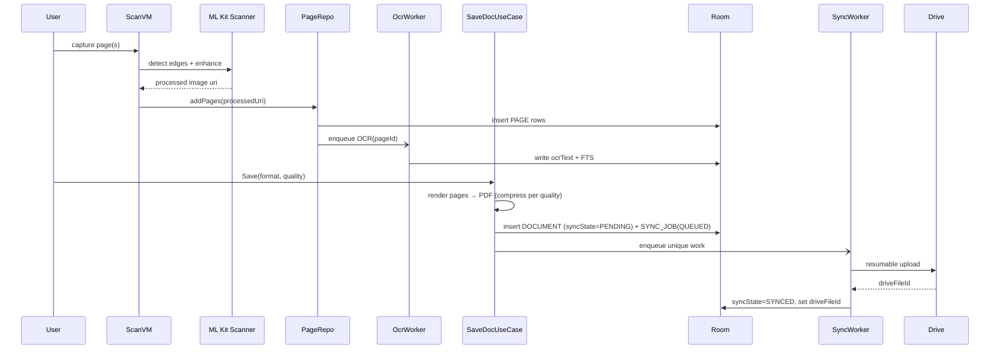
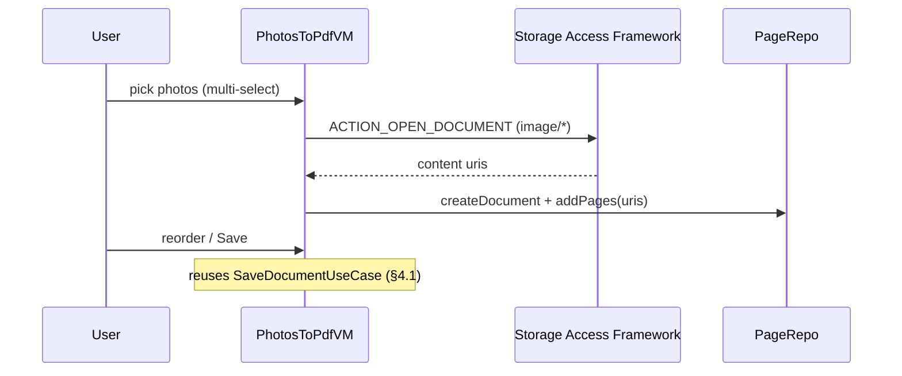
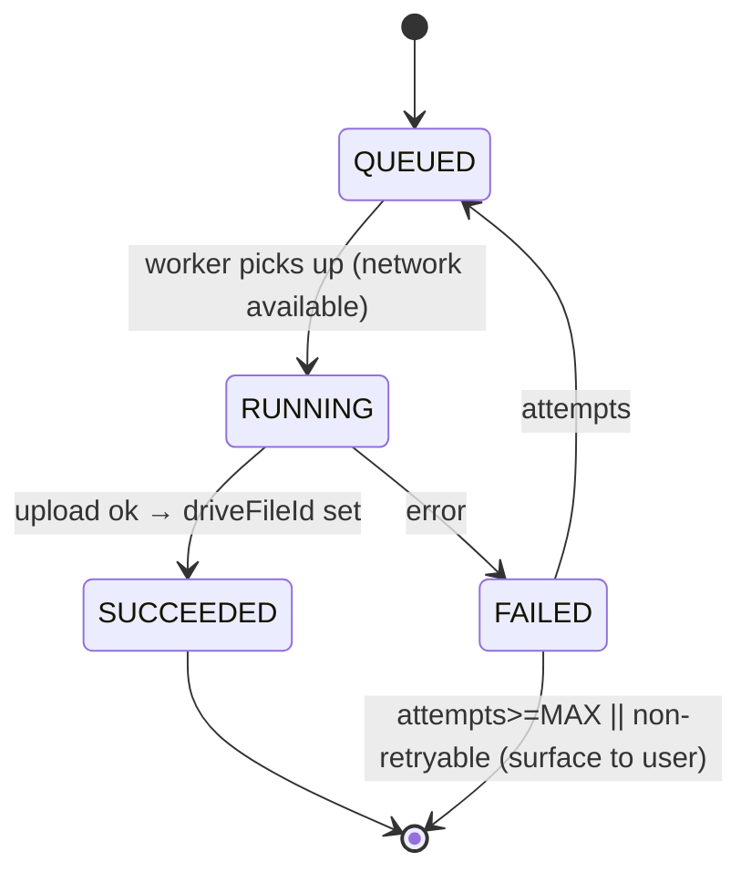

# ScanPro — Engineering Specification (Technical Design)

**Platform:** Android (v1) · **Language:** Kotlin · **UI:** Jetpack Compose
**Companion docs:** [PRD.md](PRD.md) · [BUILD_SPEC.md](BUILD_SPEC.md) · [ERD.md](ERD.md)
**Status:** Draft v1.0 · **Date:** 2026-07-17

> This is the detailed technical design. Where [BUILD_SPEC.md](BUILD_SPEC.md) answers *what we build and with what stack*, this document answers *how each part is implemented*: module contracts, sequence flows, state machines, service contracts, algorithms, error handling, concurrency, and acceptance criteria. Requirement IDs trace to [PRD.md](PRD.md).

---

## 1. Conventions

- **Result type:** all fallible operations return `Result<T, AppError>` (sealed error type, §11) — no thrown exceptions across layer boundaries.
- **IDs:** UUID v4 strings, generated app-side.
- **Time:** epoch millis (`Long`), UTC.
- **Threading:** suspend functions are main-safe (switch to appropriate dispatcher internally). §10.
- **Immutability:** UI state and domain models are immutable `data class`es; updates via `copy`.

---

## 2. Component contracts (domain layer)

Domain is pure Kotlin (no Android). Repositories are interfaces implemented in `:core:data`.

```kotlin
// --- Repositories ---
interface DocumentRepository {
    fun observeDocuments(folderId: String?): Flow<List<Document>>
    fun observeDocument(id: String): Flow<Document?>
    suspend fun createDocument(draft: DocumentDraft): Result<Document, AppError>
    suspend fun rename(id: String, name: String): Result<Unit, AppError>
    suspend fun move(id: String, folderId: String?): Result<Unit, AppError>
    suspend fun softDelete(id: String): Result<Unit, AppError>   // FR-4.3
    suspend fun restore(id: String): Result<Unit, AppError>
}

interface PageRepository {
    fun observePages(documentId: String): Flow<List<Page>>       // ordered by orderIndex
    suspend fun addPages(documentId: String, sources: List<CaptureSource>, atIndex: Int?): Result<List<Page>, AppError> // FR-E.3
    suspend fun reorder(documentId: String, order: List<String>): Result<Unit, AppError> // FR-E.1
    suspend fun removePage(pageId: String): Result<Unit, AppError>                        // FR-E.2
    suspend fun applyEdit(pageId: String, op: PageEditOp): Result<Page, AppError>         // FR-E.4/5/9/10
    suspend fun undo(pageId: String): Result<Page, AppError>     // FR-E.7
    suspend fun redo(pageId: String): Result<Page, AppError>
}

interface FolderRepository { /* CRUD, observe; FR-5.* */ }
interface DriveRepository {
    suspend fun link(provider: DriveProvider): Result<DriveConnection, AppError>          // FR-7.1
    suspend fun upload(documentId: String): Result<String /*driveFileId*/, AppError>      // FR-7.2
    suspend fun delete(driveFileId: String): Result<Unit, AppError>
}
interface TranslationRepository {
    suspend fun translate(documentId: String, target: String, engine: TranslationEngine): Result<Translation, AppError> // FR-6.*
}
interface AuthRepository { /* startPhone, verifyOtp, startEmail, currentUser, signOut; FR-1.* */ }
interface SearchRepository { suspend fun search(query: String): List<SearchHit> }        // FR-4.6
interface EntitlementRepository { fun observe(): Flow<Entitlement> }                      // free/pro gate

// --- Edit operations (sealed) ---
sealed interface PageEditOp {
    data class Crop(val rect: RectF) : PageEditOp                 // FR-E.4
    data class Rotate(val degrees: Int) : PageEditOp             // FR-E.4
    data class Filter(val filter: PageFilter) : PageEditOp       // FR-3.3
    data class Erase(val mask: EraseMask) : PageEditOp           // FR-E.5
    data class Resize(val target: ResizeTarget) : PageEditOp     // FR-E.9
    data class InsertImage(val uri: String, val placement: ImagePlacement) : PageEditOp // FR-E.10
}
```

Use cases wrap repositories for cross-cutting logic (e.g. `SaveDocumentUseCase` renders pages → PDF, persists, enqueues sync). Each use case is a single `operator fun invoke(...)`.

---

## 3. Presentation contracts

Every screen: `sealed UiState` + `ViewModel` exposing `StateFlow<UiState>` and a single `onEvent(UiEvent)`. Example (editor):

```kotlin
data class EditorUiState(
    val documentId: String,
    val pages: List<PageThumb>,
    val selectedPageId: String?,
    val activeTool: EditorTool = EditorTool.None,
    val canUndo: Boolean = false,
    val canRedo: Boolean = false,
    val isSaving: Boolean = false,
    val error: UiError? = null,
)
enum class EditorTool { None, Crop, Rotate, Filter, Resize, Erase, InsertImage, Reorder }
sealed interface EditorEvent {
    data class SelectPage(val id: String) : EditorEvent
    data class Reorder(val from: Int, val to: Int) : EditorEvent
    data class Apply(val op: PageEditOp) : EditorEvent
    data object Undo : EditorEvent
    data object AddPage : EditorEvent
    data class Save(val format: DocFormat, val quality: CompressionLevel) : EditorEvent // FR-3.7/4.7
}
```

Navigation: single-Activity, Compose Navigation graph. Routes: `auth`, `home`, `scan`, `photosToPdf`, `editor/{docId}`, `document/{docId}`, `folders`, `translate/{docId}`, `settings`.

---

## 4. Key sequence flows

### 4.1 Scan → OCR → save → sync [FR-3.*, FR-4.*, FR-7.*]

OCR runs **async, non-blocking** — save does not wait for OCR. Search availability is eventually consistent.

### 4.2 Undo/redo (editor) [FR-E.7]
Edit history is the `PAGE_EDIT` op-log (ERD §2.7). Applying an op appends a record and regenerates `processedUri` by replaying ops over `originalUri`. Undo decrements the applied cursor and re-renders; redo re-applies. `originalUri` is never mutated (non-destructive, FR-E.8).

### 4.3 Photos → PDF [FR-3.9]


### 4.4 Translate [FR-6.*]
Detect source (ML Kit LanguageId) → ensure target model downloaded → translate concatenated `ocrText` → cache `TRANSLATION` row keyed `(documentId,targetLang,engine)`. Cloud engine path is gated on `Entitlement.tier==PRO` (v1.1).

---

## 5. Sync engine (detailed) [FR-7.*]

### 5.1 State machine (`SYNC_JOB.state`)


### 5.2 Worker design
- **WorkManager** unique work per `documentId` (`ExistingWorkPolicy.APPEND_OR_REPLACE`).
- **Constraints:** `NetworkType.CONNECTED`; if user chose Wi‑Fi-only → `UNMETERED` [FR-7.3].
- **Backoff:** exponential, base 30s, cap 5 attempts; `nextAttemptAt` persisted for observability.
- **Idempotency:** re-upload checks existing `driveFileId`; if present, performs `UPDATE` not duplicate `UPLOAD`.
- **Retryable errors:** network, 5xx, 429 (respect `Retry-After`), token-refresh. **Non-retryable:** 401 after refresh fails (re-auth), 403 quota-exceeded (surface "Drive full"), 400 (bug — log).

### 5.3 Conflict model (v1)
v1 is single-device; the Drive copy is a backup target, not a two-way sync source, so no merge conflicts. Multi-device two-way sync is deferred (ERD §6.3) and would add `remoteUpdatedAt` + last-writer-wins/merge.

---

## 6. Scanning & image pipeline

| Stage | Impl | Notes |
|---|---|---|
| Capture | CameraX `ImageCapture` | JPEG to cache; also feeds analyzer |
| Detect/crop | ML Kit Document Scanner | edge + perspective; returns cropped bitmap [FR-3.2] |
| Enhance | scanner filters + custom | `AUTO/COLOR/GRAYSCALE/BW/MAGIC` [FR-3.3] |
| Auto clean-up | scanner shadow/edge removal | [FR-E.6] |
| Erase | mask + background fill | v1: region fill from sampled neighborhood (median/blur). Inpainting deferred [PRD §11.8] |
| Resize | `Bitmap.createScaledBitmap` / matrix | fit A4/Letter or custom; aspect-locked default [FR-E.9] |
| Insert image | Canvas composite | new page OR overlay layer with transform (pos/scale/rotation) [FR-E.10] |

**Storage layout**
```
filesDir/documents/{documentId}/
  original/{pageId}.jpg      # raw capture (non-destructive source)
  processed/{pageId}.jpg     # current rendered page
  export/{documentId}.pdf    # generated on save
cacheDir/capture/            # transient frames
```

**PDF generation:** `PdfDocument`, one page per `PAGE` (ordered), image drawn to page canvas at target DPI. Compression applied per `CompressionLevel` (JPEG quality + optional downscale) [FR-3.7/4.7].

```kotlin
enum class CompressionLevel(val jpegQuality: Int, val maxLongEdgePx: Int?) {
    HIGH(95, null), BALANCED(80, 2200), SMALL(60, 1600)
}
```
Because `original/` is retained, "decompress"/revert re-renders from originals at HIGH [FR-4.7].

---

## 7. OCR & search [FR-3.8, FR-4.6]

- **OCR:** ML Kit Text Recognition v2 on `processed` bitmap; store `ocrText` + detected `ocrLang` on `PAGE`. Runs in an `OcrWorker` (WorkManager, `CONNECTED` not required — on-device).
- **Index:** FTS5 virtual table `document_search(docId UNINDEXED, name, body)`. Repository updates it whenever `DOCUMENT.name` or any `PAGE.ocrText` changes (trigger or explicit write).
- **Query:** `SELECT docId FROM document_search WHERE document_search MATCH :q ORDER BY rank`; map to documents; highlight snippets client-side.

---

## 8. Auth [FR-1.*]

```mermaid
sequenceDiagram
  participant U as User
  participant A as AuthVM
  participant FB as Firebase Auth
  U->>A: enter phone
  A->>FB: verifyPhoneNumber (sends SMS)
  FB-->>U: SMS OTP
  U->>A: enter code
  A->>FB: signInWithCredential(otp)
  FB-->>A: FirebaseUser (uid)
  A->>A: upsert USER row; store session (EncryptedSharedPreferences)
```
- Email: link/password variant of the same flow.
- Session token in `EncryptedSharedPreferences`; auto-refresh via Firebase SDK.
- Drive link is **separate** (Google Sign-In incremental auth, scope `drive.file`) so users can auth without linking Drive [FR-1.5].
- Errors: invalid code, expired code, quota (SMS), network → mapped to `AuthError` (§11) with actionable UI copy.

---

## 9. Google Drive integration [FR-7.*]

**Scope:** `https://www.googleapis.com/auth/drive.file` (app-created files only — least privilege).

| Operation | Endpoint | Notes |
|---|---|---|
| Ensure app folder | `files.list` (q=name & mimeType=folder) → else `files.create` | store `appFolderId` on `DRIVE_CONNECTION` |
| Upload doc | `files.create` (resumable, `uploadType=resumable`) | parents=[appFolderId]; returns `driveFileId` |
| Update doc | `files.update` (resumable) | when `driveFileId` exists |
| Delete | `files.delete` | on document hard-delete/purge |

- **Resumable upload** for reliability on large multi-page PDFs; persist session URI to resume after process death.
- **Folder mirroring** [FR-5.4]: local `FOLDER` → Drive subfolder under app folder (`driveFolderId`).
- **Token storage:** OAuth tokens in `EncryptedSharedPreferences` keyed by connection id (not in DB).
- **Error handling:** 401→refresh→re-auth; 403 `storageQuotaExceeded`→ surface "Drive full" [PRD §11.4]; 429→backoff w/ `Retry-After`.

---

## 10. Concurrency & threading

| Work | Dispatcher |
|---|---|
| UI/state | Main |
| DB (Room suspend) | Room-managed / `Dispatchers.IO` |
| Image processing, PDF render, erase/resize | `Dispatchers.Default` (CPU) |
| OCR / ML Kit | ML Kit internal executors; wrapped in `IO` |
| Network (Drive) | `Dispatchers.IO`, inside WorkManager |

- Structured concurrency: `viewModelScope` for UI-scoped work; WorkManager for durable/background work that must survive process death.
- Large bitmaps: downsample on decode (`inSampleSize`), recycle promptly, cap in-memory working set; process pages sequentially during PDF export to bound memory (NFR perf).

---

## 11. Error taxonomy

```kotlin
sealed interface AppError {
    // Recoverable → retry/backoff
    data class Network(val cause: Throwable) : AppError
    data class RateLimited(val retryAfterMs: Long?) : AppError
    // Auth
    data object SessionExpired : AppError
    data class Auth(val kind: AuthErrorKind) : AppError    // InvalidCode, Expired, SmsQuota
    // Drive
    data object DriveQuotaExceeded : AppError
    data object DrivePermission : AppError
    // Local
    data class Storage(val cause: Throwable) : AppError    // disk full, IO
    data class Ml(val stage: String, val cause: Throwable) : AppError // OCR/translate/scan
    data class Unknown(val cause: Throwable) : AppError
}
```
Each maps to a `UiError` with plain-language message + primary action (retry / re-auth / free up space / dismiss). No raw exception strings surfaced. Non-retryable sync errors set `DOCUMENT.syncState=FAILED` and show the badge + tap-to-retry.

---

## 12. Security implementation [NFR-3, PRD §11.3]

- **Files:** app-private storage; sensitive docs wrapped with `EncryptedFile` (Jetpack Security, AES-256-GCM). Master key in Android Keystore.
- **DB:** evaluate SQLCipher for Room if OCR text of sensitive docs must be encrypted at rest; benchmark FTS impact (open decision, ERD §6.4).
- **Secrets/tokens:** `EncryptedSharedPreferences`. No secrets in VCS; injected via `local.properties`/CI.
- **Transport:** TLS; certificate transparency; no cleartext traffic (`android:usesCleartextTraffic="false"`).
- **App lock (optional):** `BiometricPrompt` gate on launch.
- **Data minimization:** free tier keeps OCR/translation on-device; only user's own Drive receives uploads.

---

## 13. Observability [PRD §9]

**Analytics events (Firebase Analytics)** — names + key params:
| Event | Params |
|---|---|
| `scan_completed` | pageCount, source(camera/photos) |
| `document_saved` | format, compression, pageCount |
| `edit_applied` | tool(crop/rotate/filter/resize/erase/insert) |
| `sync_result` | result(success/fail), attempts, errorKind |
| `translate_used` | engine(on_device/cloud), targetLang |
| `drive_linked` | provider |
| `search_performed` | hasResults |

**Crash reporting:** Crashlytics with R8 mapping upload; log non-fatal `AppError.Unknown`. **Logging:** structured, no PII/document content in logs.

---

## 14. Configuration & feature flags

- Firebase Remote Config: `paid_translation_enabled`, `wifi_only_default`, `max_sync_attempts`, kill-switches per feature.
- Build config: `minSdk 26 / target 35`; debug vs release (R8, cleartext off).
- Entitlement gate helper: `fun requirePro(): Boolean` consulted before cloud translation (v1.1).

---

## 15. Testing specification [BUILD_SPEC §12]

| Area | Cases (representative) |
|---|---|
| SaveDocumentUseCase | N-page PDF assembly; each `CompressionLevel` produces expected quality/downscale; revert re-renders from original |
| PageRepo edits | reorder persists orderIndex; remove cascades; undo/redo replays op-log; insert-image as page vs overlay |
| Sync state machine | QUEUED→RUNNING→SUCCEEDED; retryable→backoff; 403→FAILED non-retryable; idempotent re-upload uses UPDATE |
| OCR/search | ocrText indexed; FTS query ranks; accent/case folding; empty query |
| Auth | OTP success; invalid/expired code; SMS quota; email link |
| Drive repo (fake API) | folder ensure; resumable resume after kill; quota-exceeded surfaces |
| Translate | language auto-detect; model download; cache hit on repeat; Pro gate |
| Compose UI | editor tool selection, save sheet quality/format, sync badges, error states |

**Coverage target:** ≥ 80% domain + data; critical paths (save, sync, edit) have instrumented tests. OCR/translation **accuracy benchmark** on a fixed sample-doc set gates release [PRD §11.2/11.7].

---

## 16. Acceptance criteria (v1 exit)

- [ ] Scan unlimited pages; save PDF offline; view in list. [FR-3.1/3.7]
- [ ] Editor: reorder, add, remove, crop, rotate, filter, **resize**, **erase**, **insert image**, undo/redo. [FR-E.*]
- [ ] Create PDF from device photos. [FR-3.9]
- [ ] Compression levels change file size; revert to original works. [FR-4.7]
- [ ] Folders CRUD; move documents; full-text search finds OCR text. [FR-5.*/4.6]
- [ ] Phone + email auth with recovery. [FR-1.*]
- [ ] Link Google Drive; auto-sync with correct status badges; survives offline + process death. [FR-7.*]
- [ ] On-device translation with auto-detect + side-by-side. [FR-6.*]
- [ ] NFR: capture <300ms preview, 20-page PDF <5s, crash-free >99.5%, TalkBack labels present. [NFR-*]
- [ ] Privacy policy + Play data-safety complete; encryption at rest verified. [PRD §11.3]

---

## 17. Open items (engineering)

Carried from [PRD §11.7] / [ERD §6] / [BUILD_SPEC §15]:
1. Kotlin+Compose vs Flutter (confirm before M0).
2. Room SQLCipher encryption vs FTS perf.
3. Erase: mask+fill (v1) vs inpainting (later).
4. Nested folders v1 vs v1.1 (affects folder-delete behavior).
5. On-device translation accuracy → possible capped cloud fallback for free tier.
6. SMS provider/budget for phone OTP.
